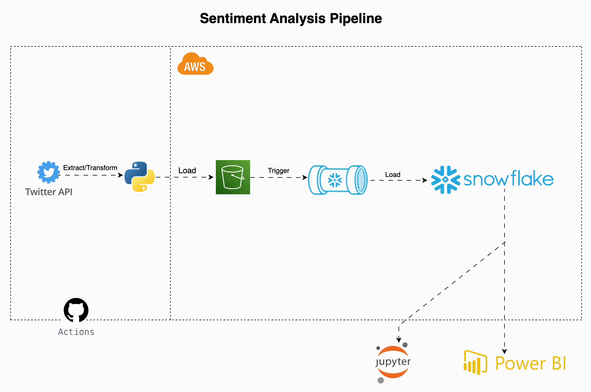
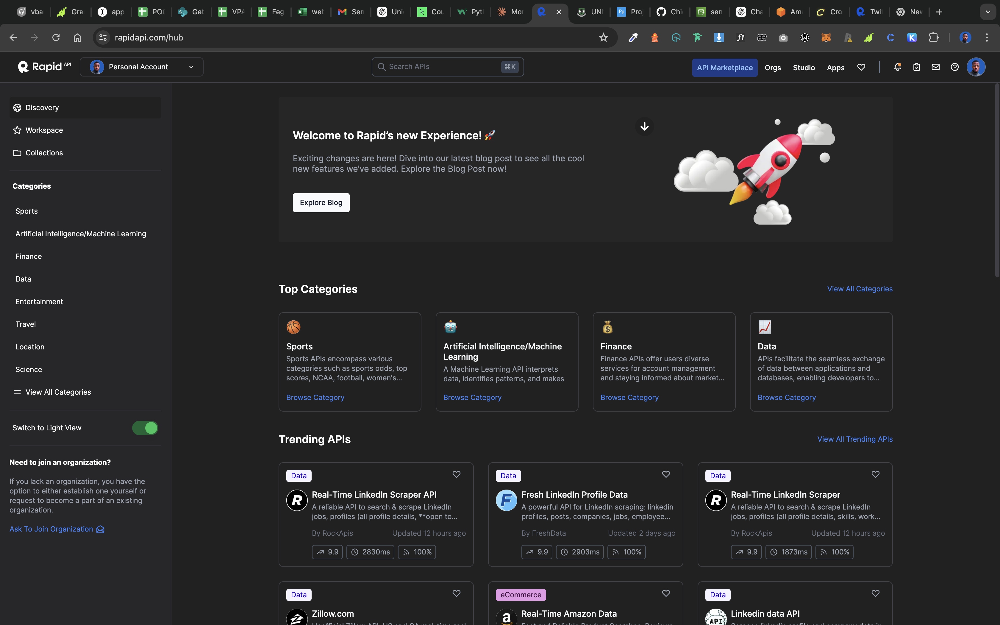
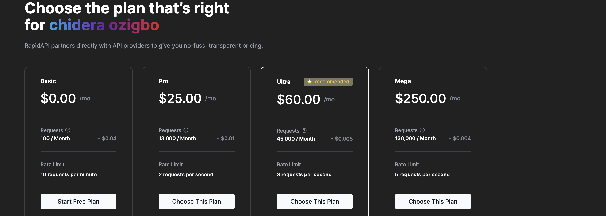
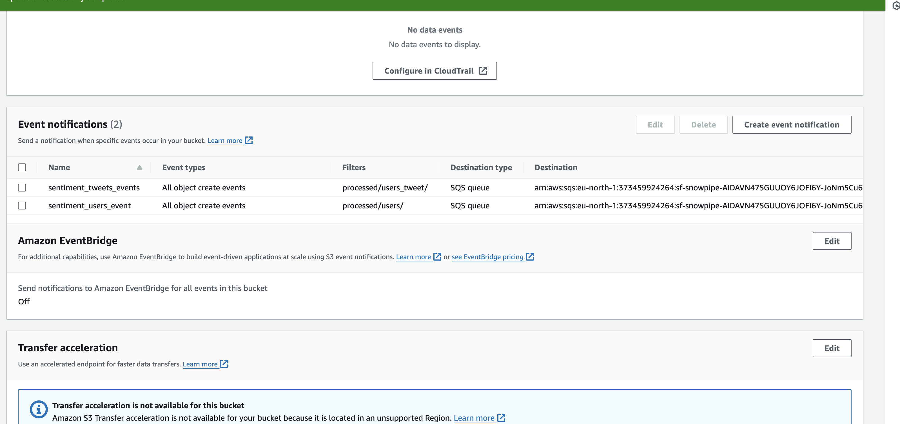
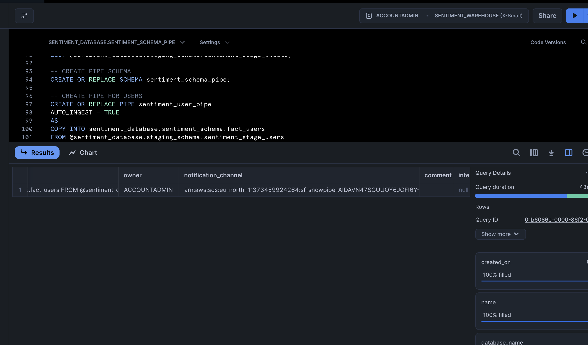
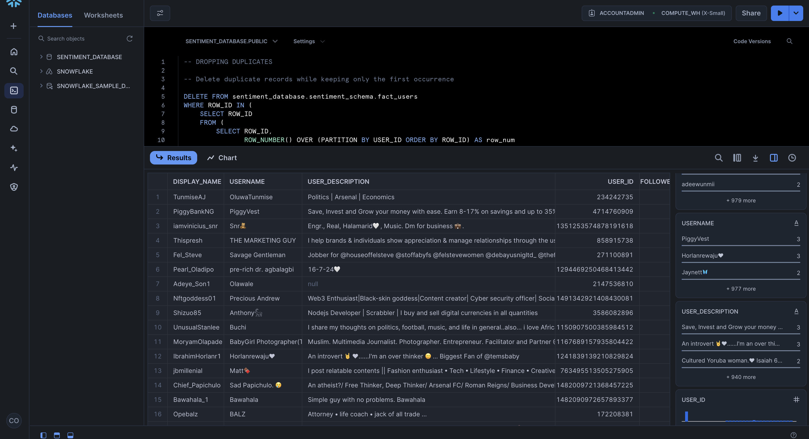
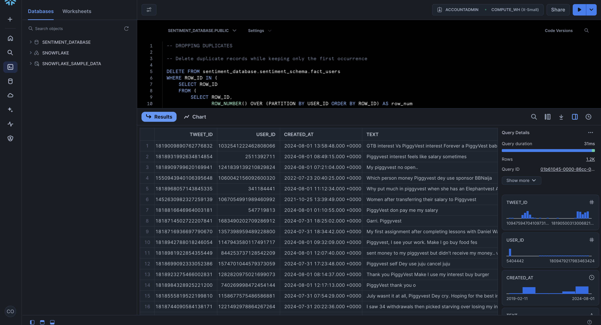

# Sentiment Analysis Pipeline

## Table of Contents
1. [Project Overview](#project-overview)
2. [Selected Brand: PiggyVest](#selected-brand-moniepoint)
3. [Objectives](#objectives)
4. [Contributors](#contributors)
5. [Team Members Task](#team-members-task)
6. [Project Timeline](#project-timeline)
7. [Why Choosing Piggyvest](#why-piggyvest-was-chosen)
   - [Proposed Brand](#proposed-brands)
8. [System Architecture](#system-architecture)
9. [Technology Stack](#technology-stack)
10. [Dependencies](#dependencies)
11. [File Structure](#file-structure)
12. [Dataset Breakdown](#dataset-breakdown)
13. [Important Links](#important-links)
14. [ETL Scripts Details](#etl-script-details)
15. [GitHub Actions](#github-actions)
16. [Setup Instructions](#setup-instructions)
17. [IAM Configuration](#iam-configuration-guide)
18. [Snowpipe and Event Notification Setup](#snowpipe-and-event-notification-setup)
19. [Random Photos & Conclusion](#random-photos--conclusion)

## Project Overview
This project aims to perform sentiment analysis on Twitter data to provide insights into public sentiment towards a specific brand. The pipeline involves extracting data from the Twitter API, transforming the raw data into structured formats, and loading the processed data into an AWS S3 bucket. Snowpipe listens for new files in the S3 bucket and loads them into a Snowflake data warehouse for further analysis. The orchestration of this pipeline is managed using GitHub Actions due to cost considerations and ease of use.

## Selected Brand: Piggvest
### Why Piggvest?
Piggvest is a prominent financial technology company renowned for its innovative savings and investment solutions. The choice of Piggvest was driven by its substantial social media presence and the increasing public interest in its services. By analyzing sentiment around Piggvest, we aim to gain valuable insights into public perception and identify areas for improvement.


## Objectives
- **Sentiment Analysis:** To gauge public sentiment towards Piggyvest based on Twitter data.
- **Data Insights:** To provide actionable insights that can help improve Piggyvest's services.
- **Automation:** To automate the data extraction, transformation, and loading (ETL) process.

## Contributors
- **Data Engineer:** [Ozigbo Chidera](https://github.com/Chideraozigbo)
- **Data Scientist:** [Onuba Winner](https://github.com/ChibuikeOnuba)
- **Data Analyst:** [Daniel Honor](https://github.com/Hon-Nour)

## Team Members Task

### Data Engineer
- **Name:** Ozigbo Chidera
- **Tasks:**
  - Designed and implemented the ETL pipeline to extract, transform, and load data from the Twitter API to AWS S3 and Snowflake.
  - Configured and managed the AWS infrastructure, including S3 buckets, IAM roles, and policies.
  - Developed and maintained the ETL scripts, ensuring efficient and reliable data processing.
  - Implemented logging and monitoring solutions to track the ETL process and troubleshoot issues.
  - Set up GitHub Actions workflows for automated ETL runs and notifications.

### Data Analyst
- **Name:** Honor Daniel
- **Tasks:**
  - Analyzed the extracted tweet data to identify trends and insights related to Piggvest.
  - Created visualizations and dashboards to present the findings to stakeholders.
  - Conducted data validation and cleaning to ensure the accuracy and quality of the data.
  - Worked closely with the data scientist to provide data for model training and evaluation.
  - Prepared detailed reports summarizing the analysis results and recommendations.

### Data Scientist
- **Name:** Onuba Winner
- **Tasks:**
  - Developed sentiment analysis models to assess public sentiment towards Piggyvest.
  - Trained and evaluated machine learning models using the cleaned tweet data.
  - Fine-tuned the models to improve accuracy and performance.
  - Integrated the sentiment analysis models into the ETL pipeline for automated scoring of new tweets.
  - Collaborated with the data analyst to interpret model results and derive actionable insights.

## Project Timeline

Our project is divided into several phases, with tasks distributed among team members based on their roles. Here's a breakdown of our timeline:

### Week 1-2: Project Setup and Infrastructure
- **Chidera Ozigbo (Data Engineer)**: 
  - Set up GitHub repository
  - Design and implement system architecture
  - Configure AWS S3 bucket
  - Set up Snowflake data warehouse
  - Implement Twitter API connection
  - Set up GitHub Actions for automated runs

### Week 3-4: Data Extraction and Processing
- **Chidera Ozigbo (Data Engineer)**: 
  - Develop data extraction script
  - Implement error handling and logging
  - Create data cleaning and transformation pipeline
  - Develop data validation checks
  - Implement Snowpipe for data ingestion
  - Optimize ETL pipeline for performance

### Week 5-6: Data Analysis and Visualization
- **Honor Daniel (Data Analyst)**: 
  - Conduct exploratory data analysis
  - Develop SQL queries for initial insights
  - Design dashboard layout
  - Implement dashboard using chosen visualization tool
  - Create visualization scripts
- **Onuba Winner (Data Scientist)**: 
  - Implement sentiment analysis using TextBlob
  - Develop advanced SQL queries for trend analysis
  - Implement anomaly detection algorithms
  - Conduct in-depth statistical analysis

### Week 7-8: Final Integration, Documentation, and Presentation
- **Chidera Ozigbo (Data Engineer)**: 
  - Integrate all components of the pipeline
  - Conduct end-to-end testing
  - Implement security measures and access controls
  - Prepare deployment documentation
- **Honor Daniel (Data Analyst)**: 
  - Finalize dashboard with real-time data updates
  - Prepare final presentation of insights
  - Create user guide for dashboard
- **Onuba Winner (Data Scientist)**: 
  - Develop predictive models based on sentiment data
  - Conduct performance evaluation of models
  - Prepare technical documentation of analysis and models

## Why Piggyvest Was Chosen

Piggyvest was selected as the brand for this project due to several compelling reasons:

1. **Market Presence:** Piggyvest has a significant presence in the financial technology sector, making it a relevant and impactful brand to analyze.
2. **Customer Interaction:** The brand actively engages with its customers on social media, providing ample data for sentiment analysis and trend identification.
3. **Growth Potential:** As a growing fintech company, understanding public sentiment and customer feedback is crucial for Piggyvest's strategic decisions and growth.
4. **Diverse Data:** Piggyvest's interactions on platforms like Twitter provide diverse and rich data, ideal for developing robust sentiment analysis models.
5. **Innovative Solutions:** Piggyvest is known for its innovative savings and investment solutions, making it an interesting subject for analyzing customer sentiment and feedback.


### Proposed Brands

Here are the lists of brands that was considered before we chose Piggvest.

1. Cowrywise
2. MTN
3. Geepay
4. Uber
5. PiggyVest
6. Hack Sultan
7. Air Peace
8. Moniepoint
9.  Indrive
10. Chowdeck


## System Architecture

Data Flow:
1.	Data Extraction: Tweets are extracted from the Twitter API using a Python script.
2.	Data Storage: The raw tweet data is stored as JSON files in the `data/raw/` directory.
3.	Data Transformation: The raw data is transformed into structured CSV files, which are saved in the `data/processed/` directory.
4.	Data Loading: The raw and processed data files are uploaded to an AWS S3 bucket.
5.	Data Ingestion: Snowpipe listens to the S3 bucket for new files and loads them into a Snowflake data warehouse.
6.	Orchestration: GitHub Actions are used to automate the ETL process, running the script weekly on Tuesdays and sends email anytime a team member pushes a code to the repo.

### Architecture Diagram:



## Technology Stack

GitHub Actions
- Reason for Use: GitHub Actions is chosen over Apache Airflow for cost-effectiveness and ease of integration with GitHub repositories. Airflow requires a live server to run, which can incur additional costs.
- Usage: Automates the ETL process, running the script weekly and notifies the team on code pushes.

Twitter API
- Reason for Use: Provides access to real-time tweet data.
- Usage: Extracts tweets related to the brand of interest.

AWS S3
- Reason for Use: Provides scalable storage for raw and processed data.
- Usage: Stores raw JSON data and processed CSV files.

Snowflake
- Reason for Use: A cloud data warehouse optimized for analytics.
- Usage: Stores and analyzes the processed data ingested from S3 via Snowpipe.

## Dependencies

This project relies on several Python libraries and modules to perform various tasks, including configuration management, data requests, data processing, and natural language processing (NLP). Below is a detailed breakdown of each dependency:

- **Configparser**
  - Purpose: Used for handling configuration files. It allows the script to read configuration settings from `secrets.ini` file, which includes API keys and AWS credentials.
  - Usage: Reading API keys and credentials securely from a configuration file.

- **Requests**
  - Purpose: Enables the script to send HTTP requests. It's essential for interacting with APIs, such as the Twitter API.
  - Usage: Fetching data from external APIs.

- **Pandas**
  - Purpose: A powerful data manipulation and analysis library. It provides data structures like DataFrames.
  - Usage: Processing and transforming the extracted data into a structured format for analysis.

- **JSON**
  - Purpose: Provides methods for parsing JSON formatted data.
  - Usage: Handling JSON responses from APIs.

- **Datetime**
  - Purpose: Supplies classes for manipulating dates and times.
  - Usage: Managing timestamps for logging and data processing.

- **Hashlib**
  - Purpose: Implements secure hash algorithms.
  - Usage: Creating unique hashes for tweets to avoid processing duplicates.

- **Re (Regular Expressions)**
  - Purpose: Provides support for regular expressions.
  - Usage: Cleaning and preprocessing text data.

- **Emoji**
  - Purpose: Allows the handling of emojis in text.
  - Usage: Detecting and removing or interpreting emojis in tweets.

- **Textblob**
  - Purpose: A simple NLP library built on NLTK and Pattern.
  - Usage: Lemmatization and text processing.

- **NLTK (Natural Language Toolkit)**
  - Purpose: A comprehensive library for NLP.
  - Usage: Tokenizing text and removing stopwords.

- **Boto3**
  - Purpose: The Amazon Web Services (AWS) SDK for Python. It enables Python developers to create, configure, and manage AWS services.
  - Usage: Interacting with AWS services like S3.

- **OS**
  - Purpose: Provides a way of using operating system dependent functionality.
  - Usage: Handling file paths and environment variables.

- **Botocore Exceptions**
  - Purpose: Provides a base exception class for Boto3.
  - Usage: Handling exceptions when interacting with AWS services.

- **Time**
  - Purpose: Provides various time-related functions.
  - Usage: Managing delays and handling timing for requests.

- **Requests Exceptions**
  - Purpose: Provides exception handling for Requests library.
  - Usage: Handling exceptions when sending HTTP requests.


## File Structure

```bash
File Structure
├── .github
│   └── workflows
│       ├── daily_etl.yaml    
│       └── push-notification.yaml
├── config
│   └── secrets.ini
├── data
│   ├── raw
│   └── processed
│       ├── users
│       └── users_tweet
├── docs
│   ├── images
│   └── analysis.md
├── logs
│   ├── etl_log.txt
│   ├── last_run.txt
│   └── processed_tweet_hashes.txt
├── models
│   └── trained_model.pkl
├── notebooks
│   └── analysis_notebook.ipynb
├── scripts
│   ├── etl
│   │   └── etl.py
│   └── model
│       └── web_app.py
├── .gitignore
├── README.md
└── requirements.txt
```
### File and Directory Descriptions
- `.github/workflows/`
  - `daily_etl.yaml`: GitHub Action to run the ETL pipeline weekly.
  - `push-notification.yaml`: GitHub Action to send an email to team members whenever any member of the team pushes to the repo.
- `config/secrets.ini`: Holds API keys and AWS credentials.
- `data/raw/`: Stores raw JSON data extracted from the Twitter API.
- `data/processed/`: Stores processed CSV files.
  - `users/`: Stores user details in CSV format.
  - `users_tweet/`: Stores tweet details in CSV format.
- `docs/`: Documentation files.
  - `images/`: Holds images for documentation.
  - `analysis.md`: Document detailing the data analysis process.
- `logs/`: Log files for monitoring the ETL process.
  - `etl_log.txt`: Logs of ETL pipeline execution.
  - `last_run.txt`: Timestamp of the last successful run.
  - `processed_tweet_hashes.txt`: Hashes of processed tweets to avoid duplication.
- `models/`: Stores trained model files.
  -	`trained_model.pkl`: Pickle file of the trained model.
- `notebooks/`: Jupyter notebooks for analysis.
  -	`analysis_notebook.ipynb`: Notebook used for data analysis.
- `scripts/`: Python scripts for ETL and model deployment.
  -	`etl/`: Directory for ETL scripts.
    - `etl.py`: Main script for the ETL pipeline.
  - `model/`: Directory for model deployment scripts.
    - `web_app.py`: Script to build the model web application.
- `.gitignore`: Specifies files and directories to be ignored by Git.
  - `config/secrets.ini`: Avoids committing sensitive information.
  - `.DS_Store`: MacOS system file.
  - `data/.DS_Store`
  - `docs/.DS_Store`
  - `scripts/.DS_Store`
- `README.md`: Project documentation and instructions.
- `requirements.txt`: Lists the dependencies required for the project.

  ## Dataset Breakdown

  ## User Table

| Column             | Data Type | Constraints              | Description                      |
|--------------------|-----------|--------------------------|----------------------------------|
| display_name       | TEXT      | NOT NULL                 | User's display name              |
| username           | TEXT      | NOT NULL                 | User's actual name               |
| user_description   | TEXT      | NULL                     | Description of the user          |
| user_id            | INTEGER   | PRIMARY KEY, NOT NULL    | Unique identifier for the user   |
| followers_count    | INTEGER   | NOT NULL                 | Number of followers              |
| favourites_count   | INTEGER   | NOT NULL                 | Number of favorites              |
| avatar             | TEXT      | NULL                     | URL of the user's avatar         |
| is_verified        | BOOLEAN   | NOT NULL                 | Whether the user is verified     |
| following_count    | INTEGER   | NOT NULL                 | Number of users being followed   |

## Tweet Table

| Column         | Data Type | Constraints              | Description                                |
|----------------|-----------|--------------------------|--------------------------------------------|
| tweet_id       | INTEGER   | PRIMARY KEY, NOT NULL    | Unique identifier for the tweet            |
| user_id        | INTEGER   | FOREIGN KEY, NOT NULL    | ID of the user who posted the tweet        |
| created_at     | TIMESTAMP | NOT NULL                 | Timestamp when the tweet was created       |
| text           | TEXT      | NOT NULL                 | Cleaned text of the tweet                  |
| url            | TEXT      | NULL                     | URL present in the tweet                   |
| mentions       | TEXT      | NULL                     | User mentions in the tweet                 |
| lang           | TEXT      | NOT NULL                 | Language of the tweet                      |
| favorites      | INTEGER   | NOT NULL                 | Number of favorites the tweet received     |
| retweets       | INTEGER   | NOT NULL                 | Number of retweets                         |
| replies        | INTEGER   | NOT NULL                 | Number of replies                          |
| quotes         | INTEGER   | NOT NULL                 | Number of quotes                           |
| views          | INTEGER   | NOT NULL                 | Number of views                            |
| hashtags       | TEXT      | NULL                     | Hashtags used in the tweet                 |

## Relationship and Constraints

- **user_id**: A primary key in the user table, ensuring each user is unique.
- **tweet_id**: A primary key in the tweet table, ensuring each tweet is unique.
- **Foreign Key**: The user_id in the tweet table references the user_id in the user table, establishing a relationship between users and their tweets.

### Explanation

- **One-to-Many Relationship**: The relationship between the user table and the tweet table is a one-to-many relationship. This means that one user (identified by user_id) can have multiple tweets (each identified by tweet_id). This relationship allows us to link each tweet to the user who posted it, making it possible to analyze and aggregate tweets by individual users.


## Important Links

- [Analysis Documentation](docs/analysis.md)
- [ETL Script](scripts/etl/etl.py)
- [GitHub Actions Workflow](.github/workflows/)
- [Model Folder](scripts/model/)
- [Notebooks](notebook)
- [Raw Data](data/raw)
- [Processed Data](data/processed)

## ETL Script Details

### Loading Processed Tweet IDs

The `load_processed_tweet_ids` function is designed to manage and track tweet IDs that have already been processed. This prevents duplicate processing by checking against previously handled tweet IDs. Below is a detailed description of how this function works.

### Steps Performed During Loading
1. **Check File Existence:**

   - The function first checks if the specified file exists at the provided file_path. This ensures that data loading is attempted only if the file is present.

2. **Read and Parse IDs:**

    - If the file exists, it is opened, and each line (representing a tweet ID) is read. Each ID is stripped of any leading or trailing whitespace and added to a set. The use of a set ensures that each ID is unique and avoids duplicates.

3. **Logging:**

    - After loading the `tweet IDs`, the function logs the number of IDs read from the file. This logging helps track the number of processed IDs and maintains transparency in the data loading process.
    - If the file does not exist, a log message is generated indicating that no processed `tweet IDs` file was found, and the function starts fresh with an empty set.
4. **Return Data:**

    - The function returns a set of `tweet IDs` that have been previously processed. This set can be used to check if a tweet has already been handled, preventing duplicate processing.

### Saving Processed Tweet IDs
The `save_processed_tweet_ids` function is designed to store tweet IDs that have been newly processed. This ensures that processed tweets are recorded and can be referenced in the future to prevent reprocessing. Below is a detailed description of how this function works.

### Steps Performed During Saving
1. **Check for New IDs:**
    - The function first checks if the `tweet_ids` set is not empty. This ensures that only new tweet IDs are saved, and the file is not updated unnecessarily. 
2. **Logging:**
    - If there are new `tweet IDs `to save, the function logs the number of IDs being saved and the file path. This helps track the saving process and ensures transparency in data handling.
    - If there are no new `tweet IDs` to save, a log message is generated indicating that there are no new tweet IDs to save.
3. **Append New IDs to File:**
    - The function opens the specified file in append mode ('a'). This ensures that new tweet IDs are added to the existing file without overwriting the current contents.
    - Each `tweet ID` in the tweet_ids set is written to the file, one per line. This allows for easy tracking and future reference. 

### Extraction


The `extract_api` function connects to a specified Twitter API endpoint, fetches tweets, and saves them as raw JSON files. It handles pagination and deduplication by checking for processed tweet IDs. The function logs each step, including successful connections and data saving. Additionally, it checks if the data is empty or `None` and logs a message if no data is received or if the data format is unexpected.

### Steps Performed During Extraction

1. **Starting the Extraction Phase:**
    - Logs the start of the extraction phase.
    - Sets up the API headers with the required API key and host.

2. **Initializing Query Parameters and Data Structures:**
    - Defines the query parameters to search for tweets related to "piggyvest".
    - Initializes an empty list to store all fetched tweet data.
    - Initializes `next_cursor` to handle pagination.
    - Loads previously processed tweet IDs to avoid duplicate processing, logging the number of IDs loaded.

3. **Handling Pagination and API Requests:**
    - Enters a loop to handle pagination and fetch all pages of data.
    - Updates query parameters with the cursor ID if available and logs the cursor ID.

4. **Retry Logic for API Requests:**
    - Implements a retry loop to handle potential API request failures.
    - Logs the attempt number and waits before retrying if an error occurs.
    - Breaks out of the retry loop upon a successful API connection or logs failure after maximum retries.

5. **Processing API Response:**
    - Parses the JSON response from the API.
    - Checks if the data is empty or `None`, or if the expected key (`timeline`) is missing, and logs a message if no data is received or if the data format is unexpected.
    - Logs the number of tweets received in each batch and the total tweets seen so far.

6. **Deduplicating Tweets:**
    - Loops through each tweet in the API response.
    - Checks if the tweet ID has already been processed.
    - Logs duplicate tweet IDs and drops them.
    - Adds unique tweets to the data list.

7. **Handling Pagination Continuation:**
    - Checks for the presence of a `next_cursor` in the API response to continue fetching the next page.
    - Logs the absence of further pages and breaks the loop when no more data is available.

8. **Saving Raw Data:**
    - Logs the start of the raw data saving process.
    - Writes all fetched tweet data to a JSON file in the specified format.
    - Logs the successful saving of raw data.

9. **Saving Processed Tweet IDs:**
    - Saves the IDs of newly processed tweets to a file to avoid reprocessing in future runs.
    - Logs the number of new tweet IDs added to the processed tweet IDs file.

10. **Returning Data and File Path:**
    - Returns the fetched tweet data and the path to the saved raw data file.

### Transformation

The `transform` function processes the raw tweet data into structured CSV files. It extracts user details and tweet information, performs data cleaning and deduplication, and logs each step of the transformation process. The function returns the paths to the saved users and tweets CSV files.

### Steps Performed During Transformation

1. **Starting the Transformation Phase:**
    - Logs the start of the transformation phase.

2. **Data Check:**
    - Checks if the input data is `None` and logs a message if no data is available for transformation. Exits the function early if no data is available.

3. **Initializing Data Structures:**
    - Initializes empty lists for storing user details and tweet data.
    - Logs the initialization of these lists.

4. **URL Extraction Pattern:**
    - Defines a regular expression pattern to extract URLs from tweet text.

5. **Processing Each Tweet:**
    - Iterates through each tweet in the input data.
    - Extracts and stores user details in the `user_details` list.
    - Extracts hashtags and constructs a string of hashtag texts.
    - Extracts URLs from tweet text using the defined pattern.
    - Cleans tweet text by removing mentions, URLs, extra spaces, and non-alphanumeric characters.
    - Converts emojis in the cleaned text to their text descriptions.
    - Logs the number of tweets transformed so far.

6. **Extracting Tweet Information:**
    - Constructs a dictionary of tweet information, including the cleaned text, URL, mentions, language, and engagement metrics.
    - Adds the tweet information to the `tweets` list.
    - Logs the completion of extracting user details and tweets.

7. **Converting Lists to DataFrames:**
    - Converts the `user_details` and `tweets` lists to pandas DataFrames.
    - Logs the successful conversion of lists to DataFrames.

8. **Dropping Duplicate User IDs:**
    - Drops duplicate user IDs from the user DataFrame.
    - Logs the number of duplicate user IDs dropped and the total number of unique users.

9. **Handling Empty or NaN Tweet Text:**
    - Drops rows with empty or NaN tweet text from the tweet DataFrame.
    - Logs the number of tweets dropped due to empty or NaN text.

10. **Saving DataFrames to CSV Files:**
    - Saves the user and tweet DataFrames to CSV files.
    - Logs the paths to the saved CSV files and the completion of the transformation phase.

11. **Handling No Data**

- If the data is `None`:
  - Logs that there is no data to transform and exits the transformation phase.
  - Returns `None, None`.

### Loading Data to S3

The `load_to_s3` function uploads a specified file to an Amazon S3 bucket. It allows for the specification of the S3 object name and handles errors that may occur during the upload process. The function returns `True` if the file is successfully uploaded, and `False` otherwise.

#### Steps Performed During the Load Phase

1. **Starting the Load Phase:**
    - Logs the start of the loading phase for the specified file path.

2. **Setting the S3 Object Name:**
    - If no `object_name` is provided, the function uses the basename of the file path as the S3 object name.

3. **Creating an S3 Client:**
    - Initializes an S3 client using the provided AWS access key and secret access key.

4. **Uploading the File:**
    - Attempts to upload the file to the specified S3 bucket with the given object name.
    - Logs a success message if the file is uploaded successfully.

5. **Handling Upload Errors:**
    - Catches any client errors that occur during the upload process.
    - Logs an error message if the upload fails.

6. **Returning the Result:**
    - Returns `True` if the file is successfully uploaded, and `False` otherwise.


### Main Function

The `main` function orchestrates the entire ETL (Extract, Transform, Load) pipeline. It ensures each phase is executed in sequence, handles failures appropriately, and logs the progress and any issues that arise.

#### Steps Performed During the ETL Pipeline

1. **Starting the ETL Pipeline:**
    - Logs the start of the ETL pipeline process.

2. **Extraction Phase:**
    - Calls the `extract_api` function to extract raw data from the API.
    - Logs a message and exits if the extraction fails.

3. **Transformation Phase:**
    - Calls the `transform` function to process and structure the raw data.
    - Logs a message and exits if the transformation fails.

4. **Loading Phase:**
    - Calls the `load_to_s3` function to upload the raw data file to the S3 bucket.
    - Uploads the transformed user and tweet data CSV files to the S3 bucket.

5. **Finishing the ETL Pipeline:**
    - Logs the completion of the ETL pipeline process.
    
## GitHub Actions
### Weekly ETL Workflow
This workflow runs every Tuesday at noon UTC and can also be triggered manually. It performs the following steps:
1. **Checkout repository:** Checks out the code from the repository.
2. **Set up Python:** Sets up Python 3.11.5.
3. **Install dependencies:** Installs required Python packages.
4. **Download NLTK data:** Downloads necessary NLTK data files.
5. **Ensure logs directory exists:** Creates a directory for logs if it doesn't exist.
6. **Add secrets.ini file:** Adds API keys and AWS credentials to `config/secrets.ini`.
7. **Run ETL script:** Executes the ETL script.
8. **Collect metadata:** Collects metadata about the run.
9. **Update last run file:** Updates the `logs/last_run.txt` file with the latest run information.
10. **Commit and push updated files:** Commits and pushes the updated logs to the repository.
11. **Success notification:** Sends a success notification email if the job succeeds.
12. **Failure alert:** Sends a failure alert email if the job fails.

### Push Notification Workflow
This workflow triggers on every push to any branch and performs the following steps:
1. **Checkout code:** Checks out the code from the repository.
2. **Get push details:** Collects details about the push event.
3. **Send email:** Sends an email notification with the push details to the team members.

## Setup Instructions

### Prerequisites
- Python 3.9 or later
- Git
- Rapid API account
- A GitHub account

### Step-by-Step Setup

### 1. Subscribe to RapidAPI

#### Step 1: Visit RapidAPI
- Go to [RapidAPI](https://rapidapi.com).



#### Step 2: Create an Account or Log In
- If you do not have an account, sign up using your email or log in using your existing credentials.

#### Step 3: Subscribe to the API
- Go to this link to use the particular twitter I used [here](#https://rapidapi.com/alexanderxbx/api/twitter-api45/playground/apiendpoint_62f1afb3-7621-423d-87c6-104da27b5c37).
- Click on the link and navigate to the top right corner of your screen. You should see `subscribe to test`


- Select the appropriate subscription plan and subscribe.




#### Step 4: Get API Credentials
- Once subscribed, go to the "Endpoints" tab of the API.
- Locate the `x-rapidapi-host` and `x-rapidapi-key` under the "Code Snippets" section.

### 2. Clone the Repository

#### Step 1: Clone the Repository
First, clone the repository to your local machine using Git:
```bash
git clone https://github.com/Chideraozigbo/sentiment-analysis-project.git
cd sentiment-analysis-project
```

### 3. Create a Virtual Environment

#### Step 1: Create and Activate Virtual Environment

It's a good practice to create a virtual environment to manage your dependencies:

``` bash
python3 -m venv venv
source venv/bin/activate  
```

### 4. Install Dependencies
 
#### Step 1: Install Required Python Packages

Install the required Python packages using pip 

``` bash
pip install -r requirements.txt
```
### 5. Create secrets.ini File

#### Step 1: Create `config` Directory

If the `config` directory does not already exist, create it:

```bash
mkdir config
```

#### Step 2: Create secrets.ini File

Create a secrets.ini file in the config directory to store your API keys and AWS credentials. This file should not be pushed to GitHub.

config/secrets.ini:

```bash
[API_KEY]
x_rapidapi_key = YOUR_X_RAPIDAPI_KEY
x_rapidapi_host = YOUR_X_RAPIDAPI_HOST

[AWS_CREDENTIALS]
ACCESS_KEY_ID = YOUR_AWS_ACCESS_KEY_ID
SECRET_ACCESS_KEY = YOUR_AWS_SECRET_ACCESS_KEY

[EMAIL]
email_user = YOUR_EMAIL_USER
email_password = YOUR_EMAIL_PASSWORD(Not your regular gmail password)
```

### 6. Modify `etl.py` File

#### Step 1: Update Bucket Name and Paths
In the `etl.py` file, update the bucket name and any other necessary configurations to match your setup. Replace any placeholder values with your actual bucket name and paths.

### 7. Configure Git to Ignore `secrets.ini`
#### Step 1: Update .gitignore

Ensure that your `secrets.ini` file is not tracked by Git by adding it to your `.gitignore` file:

```bash
config/secrets.ini
```
### 8. Setup GitHub Secrets
#### Step 1: Add GitHub Secrets

Before pushing to GitHub, add your credentials as secrets to your GitHub repository:

  - Go to your GitHub repository.
  - Navigate to "Settings" > "Secrets and variables" > "Actions".
  - Click on "New repository secret" and add the following secrets with their values:
   - `X_RAPIDAPI_KEY`
   - `X_RAPIDAPI_HOST`
   - `AWS_ACCESS_KEY_ID`
   - `AWS_SECRET_ACCESS_KEY`
   - `EMAIL_USER`
   - `EMAIL_PASS`

### 9. Push to GitHub
#### Step 1: Commit and Push Code

Make sure you have committed all your changes and pushed the code to GitHub:
```bash
git add .
git commit -m "Initial commit"
git push origin main
```
### 10. Automating with GitHub Actions
#### Step 1: GitHub Actions Workflows

The project includes GitHub Actions workflows to automate the ETL process. Ensure that your GitHub repository is set up with the necessary secrets as described above.


## IAM Configuration Guide

Here are the steps I took for create my IAM Configuration

### Step 1: Create the IAM User Group
1. **Sign in to the [AWS Management Console](https://console.aws.amazon.com/console/home?nc2=h_ct&src=header-signin).**
2. **Open the IAM console** by searching for "IAM" in the Services menu.
3. In the left navigation pane, choose **"User groups."**
4. Choose **"Create group."**
5. In the **"Group name"** field, enter `DataTeam`.
6. Skip the step to attach policies for now and choose **"Create group."**

### Step 2: Create the IAM Policy for Read-Only Access to the S3 Bucket
1. In the IAM console, in the left navigation pane, choose **"Policies."**
2. Choose **"Create policy."**
3. Select the **"JSON"** tab and paste the following policy document:

    ```json
    {
        "Version": "2012-10-17",
        "Statement": [
            {
                "Effect": "Allow",
                "Action": [
                    "s3:GetObject",
                    "s3:ListBucket"
                ],
                "Resource": [
                    "arn:aws:s3:::sentimentanalysisprojectpipeline",
                    "arn:aws:s3:::sentimentanalysisprojectpipeline/*"
                ]
            }
        ]
    }
    ```
4. Choose **"Next: Tags"** (you can skip adding tags).
5. Choose **"Next: Review."**
6. In the **"Name"** field, enter `S3ReadOnlySentimentAnalysis`.
7. Review the policy and choose **"Create policy."**

### Step 3: Attach the Policy to the User Group
1. In the IAM console, in the left navigation pane, choose **"User groups."**
2. Choose the `DataTeam` group you created.
3. In the **"Permissions"** tab, choose **"Add permissions."**
4. Choose **"Attach policies directly."**
5. Search for the `S3ReadOnlySentimentAnalysis` policy you created.
6. Select the policy and choose **"Next: Review."**
7. Choose **"Add permissions."**

### Step 4: Create the IAM Users
1. In the IAM console, in the left navigation pane, choose **"Users."**
2. Choose **"Add user."**
3. In the **"User name"** field, enter `DataScientist`.
4. Select the **"AWS Management Console access"** checkbox.
5. Choose **"Custom password"** and enter a password (ensure to store it securely).
6. Choose **"Next: Permissions."**
7. On the **"Set permissions"** page, choose **"Add user to group."**
8. Select the `DataTeam` group.
9. Choose **"Next: Tags"** (you can skip adding tags).
10. Choose **"Next: Review."**
11. Choose **"Create user."**
12. Repeat these steps to create the `DataAnalyst` user.

### Step 5: Add the Users to the Group
1. In the IAM console, in the left navigation pane, choose **"Users."**
2. Choose the `DataScientist` user.
3. In the **"User groups"** tab, choose **"Add user to groups."**
4. Select the `DataTeam` group.
5. Choose **"Add to group."**

## Snowpipe and Event Notification Setup

### 1. Create Database, Warehouse, and Schema

First, set up the foundational structures in Snowflake:

```sql
-- Create Database
CREATE OR REPLACE DATABASE sentiment_database;

-- Create Warehouse
CREATE OR REPLACE WAREHOUSE sentiment_warehouse;

-- Create Schema
CREATE OR REPLACE SCHEMA sentiment_schema;
```
### 2. Create Tables
Set up the fact and dimension tables:

```sql
-- Create fact_users table
CREATE OR REPLACE TABLE fact_users (
    display_name VARCHAR(200),
    username VARCHAR(500),
    user_description VARCHAR(200),
    user_id INTEGER,  
    followers_count INTEGER,
    favourites_count INTEGER,
    avatar VARCHAR(500),       
    is_verified BOOLEAN,
    following_count INTEGER,
    PRIMARY KEY (user_id)  
);

-- Create dim_tweets table
CREATE OR REPLACE TABLE dim_tweets (
    tweet_id INTEGER PRIMARY KEY,
    user_id INTEGER,
    created_at TIMESTAMPTZ,
    text VARCHAR(4000), 
    url VARCHAR(500), 
    mentions VARCHAR(500), 
    lang VARCHAR(6),  
    favourites INTEGER,
    retweets INTEGER,
    replies INTEGER,
    quotes INTEGER,
    view_count INTEGER,  
    hashtags VARCHAR(1000),  
    FOREIGN KEY (user_id) REFERENCES fact_users(user_id)
);
```

### 3. Create File Format
Define the file format for your CSV files:

```sql
-- Create file format schema
CREATE OR REPLACE SCHEMA file_format_schema;

-- Create CSV file format
CREATE OR REPLACE FILE FORMAT csv_format_csv
  TYPE = 'CSV'
  FIELD_OPTIONALLY_ENCLOSED_BY = '"'
  FIELD_DELIMITER = ','
  SKIP_HEADER = 1
  NULL_IF = ('NULL', 'null')
  EMPTY_FIELD_AS_NULL = TRUE
  RECORD_DELIMITER = '\n';
  ```
### 4. Create Staging Areas
Set up external stages for your S3 buckets:

```sql
-- Create staging schema
CREATE OR REPLACE SCHEMA staging_schema;

-- Create stage for tweets
CREATE OR REPLACE STAGE sentiment_stage_tweets
  URL = 's3://sentimentanalysisprojectpipeline/processed/users_tweet/'
  CREDENTIALS = (AWS_KEY_ID = 'your-aws-key-id'
                 AWS_SECRET_KEY = 'your-aws-secret-key')
  FILE_FORMAT = sentiment_database.file_format_schema.csv_format_csv;

-- Create stage for users
CREATE OR REPLACE STAGE sentiment_stage_users
  URL = 's3://sentimentanalysisprojectpipeline/processed/users/'
  CREDENTIALS = (AWS_KEY_ID = 'your-aws-key-id'
                 AWS_SECRET_KEY = 'your-aws-secret-key')
  FILE_FORMAT = sentiment_database.file_format_schema.csv_format_csv;
```

Replace `your-aws-key-id` and `your-aws-secret-key` with your actual AWS credentials.

### 5. Create Snowpipes
Set up Snowpipes for automatic data ingestion:
```sql
-- Create pipe schema
CREATE OR REPLACE SCHEMA sentiment_schema_pipe;

-- Create pipe for users
CREATE OR REPLACE PIPE sentiment_user_pipe
AUTO_INGEST = TRUE
AS
COPY INTO sentiment_database.sentiment_schema.fact_users
FROM @sentiment_database.staging_schema.sentiment_stage_users
ON_ERROR = 'CONTINUE';

-- Create pipe for tweets
CREATE OR REPLACE PIPE sentiment_tweet_pipe
AUTO_INGEST = TRUE
AS
COPY INTO sentiment_database.sentiment_schema.dim_tweets
FROM @sentiment_database.staging_schema.sentiment_stage_tweets
ON_ERROR = 'CONTINUE';
```
### 6. Set Up S3 Event Notifications
To set up S3 event notifications:

1. Go to your S3 bucket in the AWS Management Console.
2. Select the "Properties" tab.
3. Scroll down to "Event Notifications" and click "Create event notification".
4. Configure the event:
   - Name your event
   - Select the event types (typically "All object create events")
   - Choose "SQS queue" as the destination
   - Select the SQS queue that corresponds to your Snowpipe (you can find this in the pipe description)

Repeat this process for both your users and tweets S3 buckets.

Here is a snapshot of the lists of my event notifications




N.B: To get your SQS Queue. Run this sql query on your pipe
``` sql
DESC PIPE sentiment_user_pipe;
DESC PIPE sentiment_tweet_pipe;
```
You should see this under notification channel, copy and paste it as your SQS Queue topic:


### 7. Verify Pipe Status and Describe Pipes
Check the status of your pipes and view their details:

```sql
-- Check pipe status
SELECT system$pipe_status('sentiment_schema_pipe.sentiment_user_pipe');
SELECT system$pipe_status('sentiment_schema_pipe.sentiment_tweet_pipe');

-- Describe pipes
DESC PIPE sentiment_user_pipe;
DESC PIPE sentiment_tweet_pipe;
```
### 8. Set Up Access Control
Create roles and users, and grant appropriate privileges:
```sql
-- Create roles
CREATE ROLE data_scientist;
CREATE ROLE data_analyst;

-- Create users
CREATE USER Honour
  PASSWORD = 'your-password'
  DEFAULT_ROLE = data_analyst;

CREATE USER Chibuike
  PASSWORD = 'your-password'
  DEFAULT_ROLE = data_scientist;

-- Assign users to roles
GRANT ROLE data_scientist TO USER Chibuike;
GRANT ROLE data_analyst TO USER Honour;

-- Grant privileges to roles
GRANT USAGE ON WAREHOUSE sentiment_warehouse TO ROLE data_analyst;
GRANT USAGE ON WAREHOUSE sentiment_warehouse TO ROLE data_scientist;

GRANT USAGE ON DATABASE sentiment_database TO ROLE data_analyst;
GRANT USAGE ON DATABASE sentiment_database TO ROLE data_scientist;

GRANT USAGE ON SCHEMA sentiment_schema TO ROLE data_analyst;
GRANT USAGE ON SCHEMA sentiment_schema TO ROLE data_scientist;

-- Grant table-specific privileges
GRANT SELECT ON TABLE sentiment_database.sentiment_schema.FACT_USERS TO ROLE data_analyst;
GRANT INSERT, UPDATE, SELECT ON TABLE sentiment_database.sentiment_schema.FACT_USERS TO ROLE data_scientist;

GRANT SELECT ON TABLE sentiment_database.sentiment_schema.dim_tweets TO ROLE data_analyst;
GRANT INSERT, UPDATE, SELECT ON TABLE sentiment_database.sentiment_schema.dim_tweets TO ROLE data_scientist;
```

### 9. Monitor Data Loading
You can monitor the data loading process using the COPY_HISTORY view:
```sql
SELECT * FROM INFORMATION_SCHEMA.LOAD_HISTORY;
```
## Random Photos & Conclusion

### Random Photos

Photo of the dim_users table 


Photo of the fact_tweets table 


### Conclusion

In this project, we have successfully set up an end-to-end ETL pipeline for sentiment analysis on Twitter data. This pipeline includes the extraction of data from the Twitter API, transformation of raw data into a structured format, and loading of the processed data into an AWS S3 bucket and subsequently into Snowflake for further analysis. 

### Key Achievements
- **Automated Data Extraction:** Utilized the Twitter API to fetch real-time tweets and user data.
- **Data Transformation:** Cleaned and structured the data to ensure consistency and quality, ready for analysis.
- **Data Loading:** Implemented mechanisms to load data into AWS S3 and Snowflake, ensuring scalability and accessibility for analysis.
- **Logging and Monitoring:** Set up comprehensive logging to track the ETL process, helping in monitoring and debugging.
- **Retries and Failures Handling:** Added retry mechanisms to handle transient failures, ensuring the robustness of the pipeline.
- **Collaborative Team Effort:** Successfully coordinated the efforts of data engineers, data scientists, and data analysts to achieve a seamless workflow from data extraction to analysis and reporting.

### Team Contributions
- **Data Engineer:** Designed and implemented the ETL pipeline, set up the AWS S3 bucket and Snowflake database, and ensured data integrity and quality.
- **Data Scientist:** Developed the data cleaning and transformation logic, performed sentiment analysis on the processed data, and provided insights.
- **Data Analyst:** Analyzed the sentiment data, created visualizations and reports, and provided actionable insights for the business.


### Next Steps
- **Scale the Pipeline:** Enhance the pipeline to handle larger datasets and more complex transformations.
- **Advanced Analysis:** Implement more sophisticated analytics and machine learning models to derive deeper insights.
- **Real-Time Processing:** Explore real-time data processing to provide up-to-the-minute sentiment analysis.
- **Expand Data Sources:** Integrate additional social media platforms and data sources to enrich the analysis.

By following this documentation, you should be able to replicate and extend the ETL pipeline for sentiment analysis, adapting it to various datasets and analysis requirements. The detailed steps provided ensure that you can set up, configure, and run the pipeline effectively, gaining valuable insights from social media data.

Feel free to reach out if you have any questions or need further assistance with the project.


