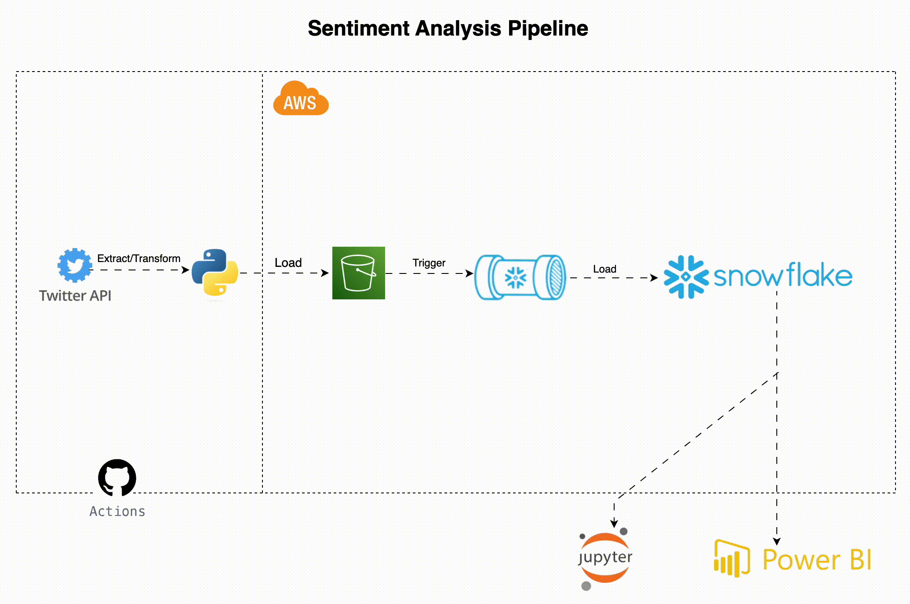

# Sentiment Analysis Pipeline

## Table of Contents
1. [Project Overview](#project-overview)
2. [Selected Brand: Moniepoint](#selected-brand-moniepoint)
3. [Objectives](#objectives)
4. [Contributors](#contributors)
5. [System Architecture](#system-architecture)
6. [Technology Stack](#technology-stack)
7. [Dependencies](#dependencies)
8. [File Structure](#file-structure)
9. [Dataset Breakdown](#)
10. [Important Links](#important-links)
11. [ETL Scripts Details](#)
12. [GitHub Actions](#github-actions)
13. [Setup Instructions](#setup-instructions)
14. [IAM Configuration](#iam-configuration)

## Project Overview
This project aims to perform sentiment analysis on Twitter data to provide insights into public sentiment towards a specific brand. The pipeline involves extracting data from the Twitter API, transforming the raw data into structured formats, and loading the processed data into an AWS S3 bucket. Snowpipe listens for new files in the S3 bucket and loads them into a Snowflake data warehouse for further analysis. The orchestration of this pipeline is managed using GitHub Actions due to cost considerations and ease of use.

## Selected Brand: Moniepoint
### Why Moniepoint?
Moniepoint is a leading financial technology company known for its innovative solutions in the digital payments space. The choice of Moniepoint was influenced by its significant presence on social media and the growing public interest in its services. By analyzing sentiment around Moniepoint, we aim to gain valuable insights into public perception and identify areas for improvement.

## Objectives
- **Sentiment Analysis:** To gauge public sentiment towards Moniepoint based on Twitter data.
- **Data Insights:** To provide actionable insights that can help improve Moniepoint's services.
- **Automation:** To automate the data extraction, transformation, and loading (ETL) process.

## Contributors
- **Data Engineer:** [Ozigbo Chidera](https://github.com/Chideraozigbo)
- **Data Scientist:** [Onuba Winner](https://github.com/ChibuikeOnuba)
- **Data Analyst:** [Daniel Honor](https://github.com/Hon-Nour)

## System Architecture

Data Flow:
1.	Data Extraction: Tweets are extracted from the Twitter API using a Python script.
2.	Data Storage: The raw tweet data is stored as JSON files in the 'data/raw/' directory.
3.	Data Transformation: The raw data is transformed into structured CSV files, which are saved in the 'data/processed/' directory.
4.	Data Loading: The raw and processed data files are uploaded to an AWS S3 bucket.
5.	Data Ingestion: Snowpipe listens to the S3 bucket for new files and loads them into a Snowflake data warehouse.
6.	Orchestration: GitHub Actions are used to automate the ETL process, running the script daily and upon code pushes.

### Architecture Diagram:



## Technology Stack

GitHub Actions
- Reason for Use: GitHub Actions is chosen over Apache Airflow for cost-effectiveness and ease of integration with GitHub repositories. Airflow requires a live server to run, which can incur additional costs.
- Usage: Automates the ETL process, running the script daily and on code pushes.
Twitter API
- Reason for Use: Provides access to real-time tweet data.
- Usage: Extracts tweets related to the brand of interest.
AWS S3
- Reason for Use: Provides scalable storage for raw and processed data.
- Usage: Stores raw JSON data and processed CSV files.
Snowflake
- Reason for Use: A cloud data warehouse optimized for analytics.
- Usage: Stores and analyzes the processed data ingested from S3 via Snowpipe.

## Dependencies

This project relies on several Python libraries and modules to perform various tasks, including configuration management, data requests, data processing, and natural language processing (NLP). Below is a detailed breakdown of each dependency:

Configparser
- Purpose: Used for handling configuration files. It allows the script to read configuration settings from secrets.ini file, which includes API keys and AWS credentials.
- Usage: Reading API keys and credentials securely from a configuration file.

Requests
- Enables the script to send HTTP requests. It's essential for interacting with APIs, such as the Twitter API.
- Usage: Fetching data from external APIs.

Pandas
- Purpose: A powerful data manipulation and analysis library. It provides data structures like DataFrames.
- Usage: Processing and transforming the extracted data into a structured format for analysis.

JSON
- Purpose: Provides methods for parsing JSON formatted data.
- Usage: Handling JSON responses from APIs.

Datetime
- Purpose: Supplies classes for manipulating dates and times.
- Usage: Managing timestamps for logging and data processing.

Hashlib
- Purpose: Implements secure hash algorithms.
- Usage: Creating unique hashes for tweets to avoid processing duplicates.

Re(Regular Expressions)
- Purpose: Provides support for regular expressions.
- Usage: Cleaning and preprocessing text data.

Emoji
- Purpose: Allows the handling of emojis in text.
- Usage: Detecting and removing or interpreting emojis in tweets.

Textblob
- Purpose: A simple NLP library built on NLTK and Pattern.
- Usage: Lemmatization and text processing.

NLTK (Natural Language Toolkit)
- Purpose: A comprehensive library for NLP.
- Usage: Tokenizing text and removing stopwords.

Boto3
- Purpose: The Amazon Web Services (AWS) SDK for Python. It enables Python developers to create, configure, and manage AWS services.
- Usage: Interacting with AWS services like S3.

OS
- Purpose: Provides a way of using operating system dependent functionality.
- Usage: Handling file paths and environment variables.

Botocore Exceptions
- Purpose: Provides a base exception class for Boto3.
- Usage: Handling exceptions when interacting with AWS services.


## File Structure

```bash
File Structure
├── .github
│   └── workflows
│       ├── daily_etl.yaml
│       └── push-notification.yaml
├── config
│   └── secrets.ini
├── data
│   ├── raw
│   └── processed
│       ├── users
│       └── users_tweet
├── docs
│   ├── images
│   └── analysis.md
├── logs
│   ├── etl_log.txt
│   ├── last_run.txt
│   └── processed_tweet_hashes.txt
├── models
│   └── trained_model.pkl
├── notebooks
│   └── analysis_notebook.ipynb
├── scripts
│   ├── etl
│   │   └── etl.py
│   └── model
│       └── web_app.py
├── .gitignore
├── README.md
└── requirements.txt
```
### File and Directory Descriptions
- .github/workflows/
  - daily_etl.yaml: GitHub Action to run the ETL pipeline daily.
  - push-notification.yaml: GitHub Action to trigger the ETL pipeline on code pushes.
- config/secrets.ini: Holds API keys and AWS credentials.
- data/raw/: Stores raw JSON data extracted from the Twitter API.
- data/processed/: Stores processed CSV files.
  - users/: Stores user details in CSV format.
  - users_tweet/: Stores tweet details in CSV format.
- docs/: Documentation files.
  - images/: Holds images for documentation.
  - analysis.md: Document detailing the data analysis process.
- logs/: Log files for monitoring the ETL process.
  - etl_log.txt: Logs of ETL pipeline execution.
  - last_run.txt: Timestamp of the last successful run.
  - processed_tweet_hashes.txt: Hashes of processed tweets to avoid duplication.
- models/: Stores trained model files.
  -	trained_model.pkl: Pickle file of the trained model.
- notebooks/: Jupyter notebooks for analysis.
  -	analysis_notebook.ipynb: Notebook used for data analysis.
- scripts/: Python scripts for ETL and model deployment.
  -	etl/: Directory for ETL scripts.
    - etl.py: Main script for the ETL pipeline.
  - model/: Directory for model deployment scripts.
    - web_app.py: Script to build the model web application.
- .gitignore: Specifies files and directories to be ignored by Git.
  - config/secrets.ini: Avoids committing sensitive information.
  - .DS_Store: MacOS system file.
  - data/.DS_Store
  - docs/.DS_Store
  - scripts/.DS_Store
  - README.md: Project documentation and instructions.
  - requirements.txt: Lists the dependencies required for the project.

  ## Dataset Breakdown

  ## User Table

| Column             | Data Type | Constraints              | Description                      |
|--------------------|-----------|--------------------------|----------------------------------|
| display_name       | TEXT      | NOT NULL                 | User's display name              |
| username           | TEXT      | NOT NULL                 | User's actual name               |
| user_description   | TEXT      | NULL                     | Description of the user          |
| user_id            | INTEGER      | PRIMARY KEY, NOT NULL    | Unique identifier for the user   |
| followers_count    | INTEGER   | NOT NULL                 | Number of followers              |
| favourites_count   | INTEGER   | NOT NULL                 | Number of favorites              |
| avatar             | TEXT      | NULL                     | URL of the user's avatar         |
| is_verified        | BOOLEAN   | NOT NULL                 | Whether the user is verified     |
| following_count    | INTEGER   | NOT NULL                 | Number of users being followed   |

## Tweet Table

| Column         | Data Type | Constraints              | Description                                |
|----------------|-----------|--------------------------|--------------------------------------------|
| tweet_id       | INTEGER      | PRIMARY KEY, NOT NULL    | Unique identifier for the tweet            |
| user_id        | INTEGER      | FOREIGN KEY, NOT NULL    | ID of the user who posted the tweet        |
| created_at     | TIMESTAMP | NOT NULL                 | Timestamp when the tweet was created       |
| text           | TEXT      | NOT NULL                 | Cleaned text of the tweet                  |
| url            | TEXT      | NULL                     | URL present in the tweet                   |
| mentions       | TEXT      | NULL                     | User mentions in the tweet                 |
| lang           | TEXT      | NOT NULL                 | Language of the tweet                      |
| favorites      | INTEGER   | NOT NULL                 | Number of favorites the tweet received     |
| retweets       | INTEGER   | NOT NULL                 | Number of retweets                         |
| replies        | INTEGER   | NOT NULL                 | Number of replies                          |
| quotes         | INTEGER   | NOT NULL                 | Number of quotes                           |
| views          | INTEGER   | NOT NULL                 | Number of views                            |
| hashtags       | TEXT      | NULL                     | Hashtags used in the tweet                 |

## Relationship and Constraints

- **user_id**: A primary key in the user table, ensuring each user is unique.
- **tweet_id**: A primary key in the tweet table, ensuring each tweet is unique.
- **Foreign Key**: The user_id in the tweet table references the user_id in the user table, establishing a relationship between users and their tweets.

## Important Links

- [Analysis Documentation](docs/analysis.md)
- [ETL Script](scripts/etl/etl.py)
- [GitHub Actions Workflow](.github/workflows/)
- [Model Folder](scripts/model/)
- [Notebooks](notebook)
- [Raw Data](data/raw)
- [Processed Data](data/processed)

## ETL Script Details

### Extraction

The `extract_api` function connects to the Twitter API, fetches tweets, and saves them as raw JSON files. It handles pagination and deduplication by checking for processed tweet hashes. The function logs each step, including successful connections and data saving.

### Transformation

The `transform` function converts raw tweet data into structured CSV files. It extracts user details and tweet information, cleans the text, removes duplicates, and saves the data into CSV files. The function logs each transformation step and ensures the data is ready for loading.

### Loading

The `load_to_s3` function uploads files to an AWS S3 bucket. It takes the file path, bucket name, and object name as arguments and logs the upload process. The function ensures data is available in S3 for Snowpipe to ingest into Snowflake.

### Main Function

The `main` function orchestrates the ETL process by calling the extraction, transformation, and loading functions sequentially. It logs the start and completion of the ETL pipeline.

## GitHub Actions
### Daily ETL Workflow
This workflow runs every Monday at noon UTC and can also be triggered manually. It performs the following steps:
1. **Checkout repository:** Checks out the code from the repository.
2. **Set up Python:** Sets up Python 3.11.5.
3. **Install dependencies:** Installs required Python packages.
4. **Download NLTK data:** Downloads necessary NLTK data files.
5. **Ensure logs directory exists:** Creates a directory for logs if it doesn't exist.
6. **Add secrets.ini file:** Adds API keys and AWS credentials to `config/secrets.ini`.
7. **Run ETL script:** Executes the ETL script.
8. **Collect metadata:** Collects metadata about the run.
9. **Update last run file:** Updates the `logs/last_run.txt` file with the latest run information.
10. **Commit and push updated files:** Commits and pushes the updated logs to the repository.
11. **Success notification:** Sends a success notification email if the job succeeds.
12. **Failure alert:** Sends a failure alert email if the job fails.

### Push Notification Workflow
This workflow triggers on every push to any branch and performs the following steps:
1. **Checkout code:** Checks out the code from the repository.
2. **Get push details:** Collects details about the push event.
3. **Send email:** Sends an email notification with the push details.

## Setup Instructions
